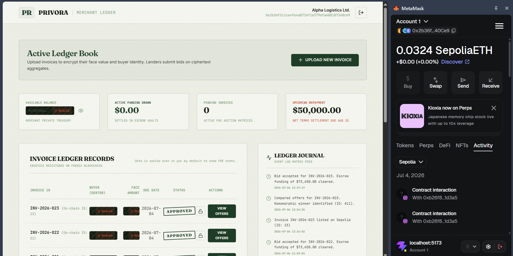
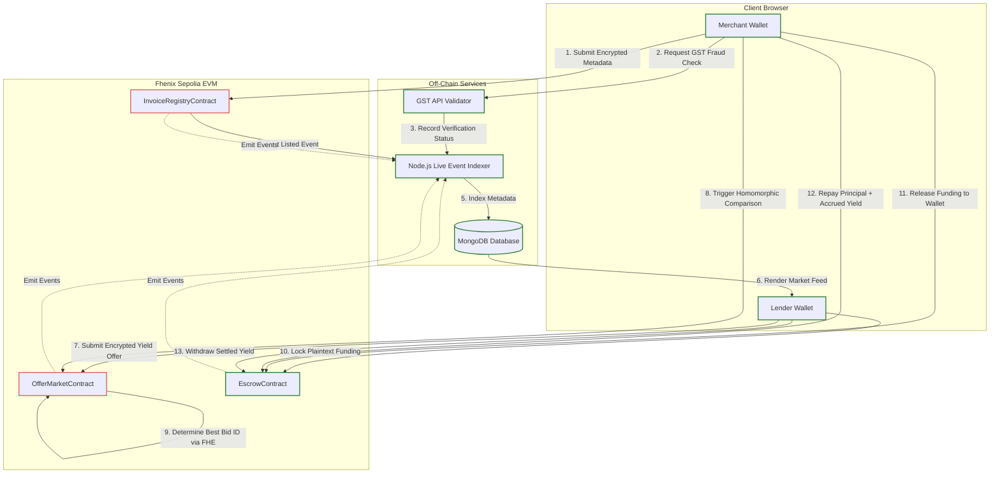

# Privora 🔒💼

### **Confidential SME Invoice Financing & Yield Auction Protocol Powered by Fhenix CoFHE**

[](https://soliditylang.org/)
[](https://fhenix.io/)
[](https://sepolia.etherscan.io/)
[](https://spdx.org/licenses/BSD-3-Clause-Clear.html)

---

## 🖼️ Hero Dashboard Terminal


*Figure 1: The Privora Unified Portfolio Ledger displaying active private credit positions, secure wallet balances, and real-time yield accrual.*

---

## ⚠️ The Problem

Small and Medium Enterprises (SMEs) face a **$5.2 trillion annual funding gap**. Invoice financing is a vital tool for immediate liquidity, but traditional platforms expose sensitive company finances to competitors, lenders, and buyers. Every listed receivable reveals exact invoice amounts, counterparty buyer identities, payment due dates, and bidding interest rates. This total lack of transactional confidentiality weakens the SME's negotiation position, leaks proprietary supply-chain data, and exposes their financial health on public ledgers.

---

## 💡 The Solution

**Privora** provides complete transactional privacy for SMEs by using Fully Homomorphic Encryption (FHE) to keep sensitive corporate data completely sealed, while still allowing decentralized market competition.
* **Encrypted Invoice Registry:** SME invoices are stored on-chain with encrypted face values, buyer addresses, and payment due dates.
* **Sealed Bid Auction:** Private credit providers submit FHE-encrypted interest rates and capital offers.
* **Homomorphic Best-Bid Engine:** The protocol evaluates and identifies the lowest-rate lender on-chain *without ever decrypting a single bid*.
* **Plaintext Verification Layers:** External public registry data (like GST numbers and invoice registration hashes) are verified off-chain to eliminate double-invoicing fraud without exposing transactional amounts.
* **Trustless Escrow Settlement:** Plaintext fund lock-up and repayment execution are decoupled from FHE terms to guarantee gas-efficient execution.

---

## 🔒 Why This Is Real FHE (Not Just Encrypted Storage)

Unlike naive "encrypt on input, decrypt on output" dApps that simply act as expensive databases, **Privora executes stateful computation directly on encrypted values on-chain**.

### 1. Homomorphic Comparison Engine
Lender interest rates are homomorphically compared inside the smart contract to select the winning proposal. The contract never learns the rates or the identity of the winner during execution.

As implemented in `OfferMarket.sol` (`compareOffers`):
```solidity
// Loop through and compare encrypted rates homomorphically
for (uint256 i = 1; i < offerIds.length; i++) {
    uint256 currentOfferId = offerIds[i];
    euint64 currentRate = _offers[currentOfferId].rate;
    euint64 currentOfferIdEnc = FHE.asEuint64(uint64(currentOfferId));

    // Homomorphic comparison: is currentRate < bestRate?
    ebool isLess = FHE.lt(currentRate, bestRate);

    // Select the best rate and best offer ID without decrypting
    bestRate = FHE.select(isLess, currentRate, bestRate);
    bestOfferId = FHE.select(isLess, currentOfferIdEnc, bestOfferId);
}
```

### 2. Privacy Architecture: Plaintext vs. Encrypted Data

Privora uses a hybrid data structure designed for auditability and verification:

| Data Field | Security State | Technical Type | Architectural Rationale |
| :--- | :---: | :--- | :--- |
| **Invoice ID & Status** | Plaintext | `uint256` / `enum` | Allows indexing, event tracking, and dashboard rendering. |
| **Merchant Address** | Plaintext | `address` | Required to verify ownership and route funding payouts. |
| **GST / Registration ID** | Plaintext | `string` (Off-chain) | Verified via external API to prevent double-financing fraud. |
| **Invoice Face Value** | **Encrypted** | `euint64` | Protects corporate sales volume and cash flow details. |
| **Debtor (Buyer) Address** | **Encrypted** | `eaddress` | Shields customer lists and supply chain relationships. |
| **Due Date Timestamp** | **Encrypted** | `euint32` | Prevents public mapping of working capital payment cycles. |
| **Lender Interest Rate** | **Encrypted** | `euint64` | Protects bidding strategy and rate sheets from competitors. |

---

## 📐 Protocol Architecture



---

## 🛠️ Tech Stack

| Layer | Component / Technology | Purpose |
| :--- | :--- | :--- |
| **Smart Contracts** | Solidity v0.8.28, Fhenix CoFHE Contracts | Private state registry and homomorphic bidding computation |
| **Cryptography** | `@fhenixprotocol/cofhe-contracts`, `@cofhe/sdk` | Client-side FHE input sealing and view permits |
| **Frontend** | React v19.2.7, Vite v8.1.1, TS v6.0.2 | Web3 dashboard and interactive auction interface |
| **Styling** | Tailwind CSS v3.4.19, Lucide React | Sleek dark-mode and glassmorphism interface |
| **Data Viz** | Recharts v3.9.1 | Portfolio yield distribution and historical performance charts |
| **Backend API** | Node.js, Express v4.19.2 | Off-chain API routing and activity feed endpoints |
| **Database** | MongoDB, Mongoose v8.4.3 | Event log store and non-sensitive cache |
| **Event Indexer** | Ethers v6.13.1 Polling Indexer | Syncs and indexes smart contract events (polling every 15s) |
| **EVM Network** | Fhenix Helium-3 Sepolia Testnet | Privacy-preserving L2 Layer with native FHE support |

---

## 📜 Smart Contracts Directory

<details>
<summary><b>Click to expand full contract function list</b></summary>

### 1. InvoiceRegistry
Deploys a secure database of invoices where face value and debtor addresses remain encrypted on-chain.
* **Deployed Address:** [`0xcB163190869b5bf428EFB92494F3987194cBd8C7`](https://sepolia.etherscan.io/address/0xcB163190869b5bf428EFB92494F3987194cBd8C7)
* **Key Functions:**
  * `createInvoice(InEuint64, InEaddress, InEuint32)`: Registers encrypted invoice.
  * `listOnMarketplace(uint256)`: Opens the invoice to public bidding.
  * `getInvoiceMetadata(uint256)`: Returns public metadata (status, merchant, listedAt).
  * `getEncryptedInvoiceData(uint256)`: Returns encrypted FHE data handles.

### 2. OfferMarket
Manages private bidding. Allows lenders to bid blindly and merchants to select the best yield rate homomorphically.
* **Deployed Address:** [`0xb26f862716AAB6614Bedf348ae3eEB1AFd21D3A5`](https://sepolia.etherscan.io/address/0xb26f862716AAB6614Bedf348ae3eEB1AFd21D3A5)
* **Key Functions:**
  * `submitOffer(uint256, InEuint64, InEuint64)`: Lodges encrypted rate and capital bids.
  * `compareOffers(uint256)`: Triggers on-chain homomorphic selection.
  * `getBestOffer(uint256)`: Returns the encrypted best offer ID handle.
  * `acceptOffer(uint256, uint256)`: Merchant accepts the winning offer.

### 3. Escrow
Decoupled plaintext settlement ledger holding actual funding payouts and principal repayments.
* **Deployed Address:** [`0x2836C60848e65AF07115feC8896D9e6458617E4C`](https://sepolia.etherscan.io/address/0x2836C60848e65AF07115feC8896D9e6458617E4C)
* **Key Functions:**
  * `lockFunds(uint256, uint256)`: Deposits funding capital into escrow.
  * `releaseFunds(uint256)`: Transfuses funds to the merchant's wallet.
  * `repay(uint256)`: Merchant returns capital at invoice maturity.
  * `settleInvoice(uint256)`: Disburses repayment + yield to the winning lender.

</details>

---

## 🚀 Step-by-Step Demo Walkthrough

### Step 1: Merchant Invoice Sealing & Verification
The merchant uploads the invoice. The amount, buyer, and due date are sealed client-side before being submitted to the blockchain. The company's GST number is verified off-chain.
* **Reference UI:** `screenshots/step-1-upload.png`

### Step 2: listed Marketplace Feed
Lenders browse listed receivables. Sensitive financial data remains shielded behind FHE placeholders (`[ENCRYPTED]`), while public indicators (risk tier, tenor, and amount range) remain readable.
* **Reference UI:** `screenshots/step-2-marketplace.png`

### Step 3: Lender Blind Bidding Ceremony
The lender inputs their capital bid and discount rate. The terms are encrypted and signed before being sent to the contract, keeping the bid hidden from competing credit providers.
* **Reference UI:** `screenshots/step-3-bidding.png`

### Step 4: Homomorphic Comparison & Decrypt-on-Reveal Selection
The merchant initiates an on-chain evaluation. The smart contract compares the encrypted bids, identifies the winner, and generates a view permit that lets the merchant decrypt and review only the winning bid's terms.
* **Reference UI:** `screenshots/step-4-compare.png`

### Step 5: Trustless Escrow & Settlement Payout
The winning lender deposits the funding capital into the escrow vault. The merchant releases the funds to their wallet, and subsequently repays the balance at maturity to settle the position.
* **Reference UI:** `screenshots/step-5-settlement.png`

---

## ⚙️ Getting Started & Setup

### Prerequisites
* **Node.js:** v20.x or higher
* **MongoDB:** Local instance running (`mongodb://localhost:27017`)
* **Browser Extension:** MetaMask connected to the Fhenix Sepolia Helium-3 network.
* **Test ETH:** Sepolia Test ETH from the [Fhenix Sepolia Faucet](https://faucet.fhenix.zone/).

### Setup Instructions

1. **Clone & Install Workspace Dependencies:**
   ```bash
   git clone https://github.com/shwetagore16/Privora.git
   cd Privora
   npm install
   ```

2. **Configure Environment Variables:**
   Create a `.env` file in the `backend/` directory:
   ```env
   PORT=5000
   MONGODB_URI=mongodb://localhost:27017/privora
   SEPOLIA_RPC_URL=https://sepolia.drpc.org
   OFFER_MARKET_ADDRESS=0xb26f862716AAB6614Bedf348ae3eEB1AFd21D3A5
   ```

3. **Start the MongoDB Backend API & Event Indexer:**
   ```bash
   cd backend
   npm install
   npm run dev
   ```
   *The Express server will start on port 5000, connect to MongoDB, and start the live 15-second block event polling loop.*

4. **Launch the Frontend Client:**
   Open a new terminal window at the repo root and run:
   ```bash
   npm run dev
   ```
   *Open [http://localhost:5173](http://localhost:5173) in your browser.*

---

## 📂 Project Structure

```text
Privora/
├── backend/                   # Node/Express API Server & Event Indexer
│   ├── abi/                   # Compiled JSON Contract ABIs
│   ├── models/                # Mongoose Database Schemas
│   ├── indexer.js             # Historical Sync & Event Listener Engine
│   └── server.js              # REST API Router & Database Initializer
├── contracts/                 # Hardhat EVM Contract Workspace
│   └── contracts/             
│       ├── InvoiceRegistry.sol # Private Invoice State Storage
│       ├── OfferMarket.sol    # Homomorphic Comparison & Auction Market
│       └── Escrow.sol         # Plaintext Yield Lock & Repayment Ledger
├── screenshots/               # Walkthrough and UI image assets
├── src/                       # React Frontend Application
│   ├── components/            # Reusable UI Elements (RedactionBar, Toast)
│   ├── config/                # Contract Deployed Addresses & ABIs
│   ├── features/              
│   │   ├── auth/              # Mock Identity Provider & Web3 Context
│   │   ├── lender/            # Lender Marketplace & Portfolio Terminal
│   │   └── merchant/          # Merchant Dashboard, Upload & Comparator UI
│   └── lib/                   
│       ├── mock-data.ts       # State persistence fallback database
│       └── web3/              # Ethers6/Fhenix CoFHE integration hooks
└── package.json               # Frontend Node package declarations
```

---

## 🔮 Known Limitations & Roadmap

* **Testnet-Only Dependencies:** The protocol is highly reliant on Sepolia RPC performance. During high latency periods, permit signatures or on-chain comparisons can take up to 30-45 seconds.
* **MongoDB Indexing Lag:** Off-chain indexing polls every 15 seconds. Real-time updates have been supplemented on the frontend using direct, on-chain state calls (`getOfferStatus()`) to bypass indexer delay.
* **GST Verification Layer:** The current tax-registry check utilizes a sandbox-restricted API profile.
* **Planned Roadmap:**
  * Implement gasless meta-transactions using ERC-2771 to subsidize FHE gas costs for small merchants.
  * Integrate multi-lender syndicates allowing multiple lenders to co-fund large invoices.
  * Native mobile application with biometric key generation for FHE view permits.

---

## 🏆 Hackathon Context

Privora was built for the **Fhenix FHE Hackathon** to demonstrate real-world utility for homomorphic computation in private corporate debt.

* **Core Focus:** Fully Homomorphic Encryption (FHE) applied to confidential yield bidding and client-side access control using CoFHE SDK view permits.

---

## 📄 License

This project is licensed under the **BSD-3-Clause-Clear License** - see the [InvoiceRegistry.sol](contracts/contracts/InvoiceRegistry.sol) header for details.
